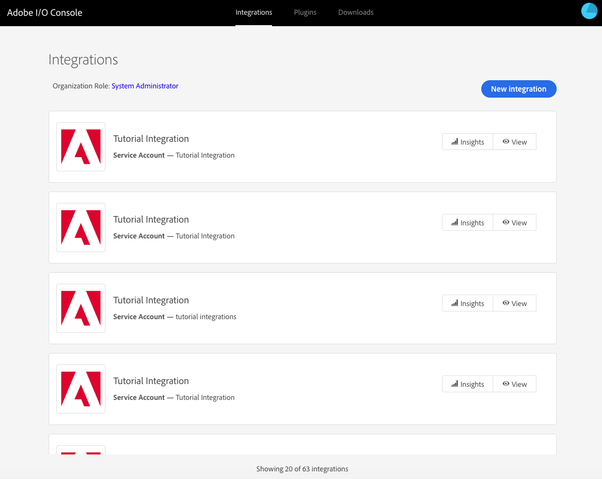
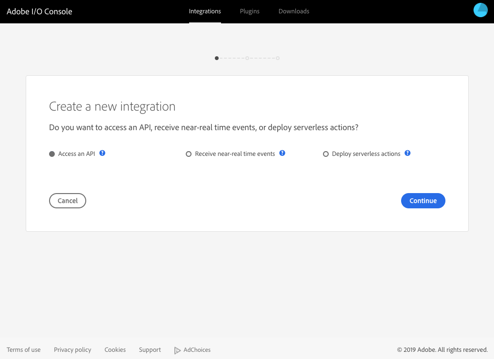
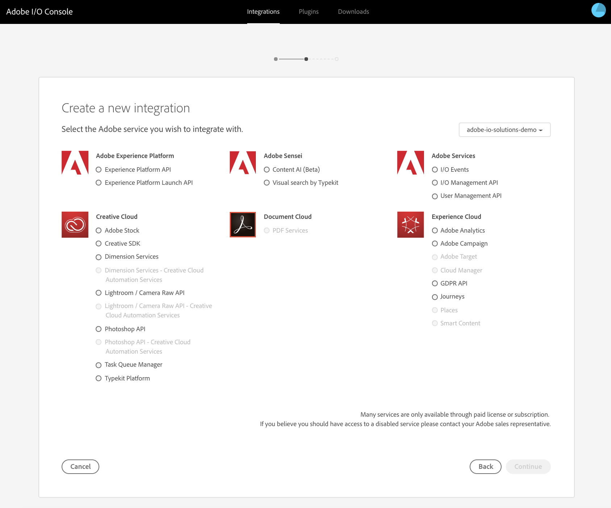
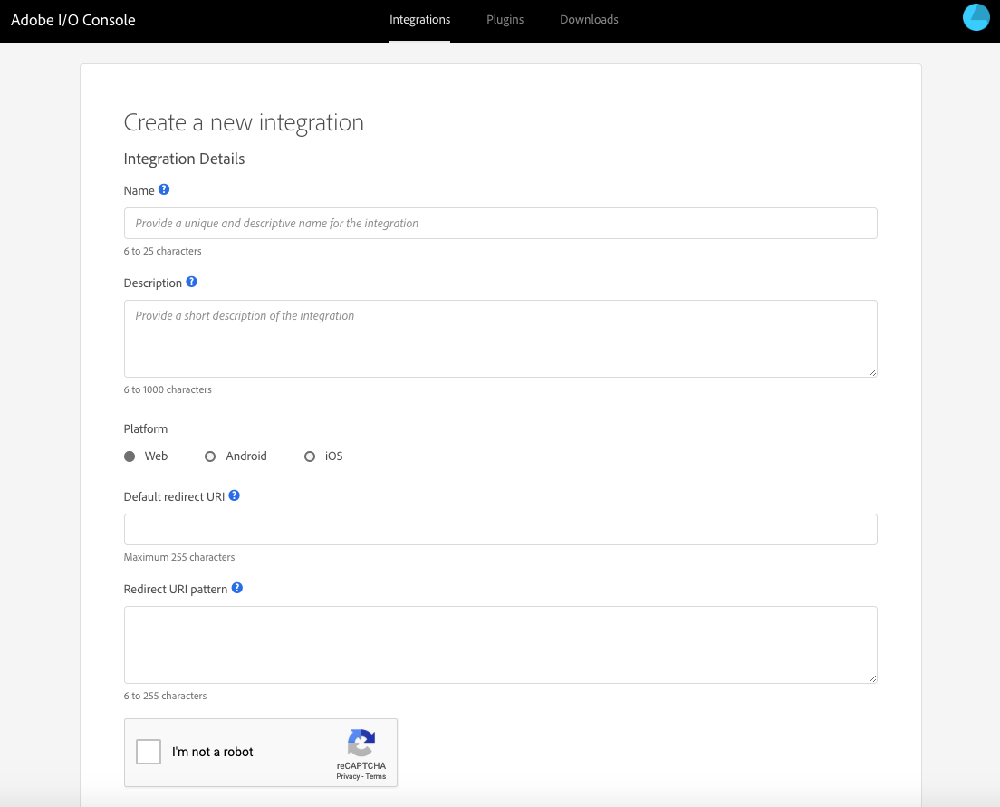

# API Key Integration

A small collection of Adobe services (e.g. Adobe Stock) require authorization, but do not require authentication. These services can be called _anonymously_ and typically provide consistent results regardless of the application or user that made the request. An **API Key** is the only client credential required for these services. These integrations do not need to pass an access token with each request.

To obtain an API key, you&rsquo;ll need to create an API Key Integration using the Adobe I/O Console, as described here.
If your integration needs to access Adobe services or content on behalf of a user or an Adobe enterprise organization, it needs additional credentials for authentication. For more information, check out the articles on **[OAuth Authentication](OAuthIntegration.md)** and **[Service Account Authentication](ServiceAccountIntegration.md)**.

This article will walk you through the steps to set up an **API Key integration**.

## API Key Integration Workflow

[Step 1: Subscribe to an Adobe service](#step-1-subscribe-to-an-adobe-service)

[Step 2: Configure an API Key integration](#step-2-configure-an-api-key-integration)

[Step 3: Try It](#step-3-try-it)

### Step 1: Subscribe to an Adobe service

1. To create a new API Key integration, sign in to the [Adobe I/O Console](https://console.adobe.io/) with your Adobe ID and select **New Integration**. (Notice that you may also choose existing integrations and edit their details from here.)  
  
    <kbd></kbd>

2. Choose the type of service you want to include in your integration. You can get API access to several Adobe services or subscribe to near real-time events. An integration can access multiple services and event sources. Simply perform these steps for each service or event you want to add to your integration.  
  
    <kbd></kbd>

3. Select **Access an API** to create an integration that will access an Adobe product API or service. You will have an opportunity to subscribe to additional services and events once you have created the integration.

4. Choose the service or event source that you would like to add to your integration. APIs and products available through Adobe I/O are typically listed by cloud.  
  
    <kbd></kbd>

### Step 2: Configure an API Key integration

1. The configuration page lets you provide all of the required details for a new integration, or add new information to update an existing integration. On the page shown below, enter your integration details.  
  **Tip:** Give your integrations accurate and descriptive names. Integrations are shared with developers within your organization, so choose a name that is clear and easily understood. Generic names like My Test App are discouraged.  
  
    <kbd></kbd>

| Detail | Description |
|---|---|
| Name | Enter a unique name to easily identify your integration. |
| Description | Provide a brief description about this integration. If you have multiple applications or access multiple services, you can use these properties to better organize your integrations. |
| Platform | Select a platform on which the integration is intended to be used: `iOS`, `Android`, or `Web`. |
| Default redirect URI | After a user successfully authorizes an application, the authorization server will redirect the user back to the application with an authorization code in the URI. Because the redirect URI will contain sensitive information, it is critical that the service doesn’t redirect the user to arbitrary locations. _(HTTPS required)_ |
| Redirect URI pattern | A comma-separated list of URI patterns to validate additional custom redirect URIs passed along with the authorization request. _(HTTPS required)_ For example, `https://www\\.myapp\\.com` will allow redirect URIs like `https://www.myapp.com/OAuth/callback`. |  
  
2. Select **Create integration**.

3. When creation is confirmed, visit the Overview section for your new integration. The overview section contains the newly generated API Key and allows you to subscribe to additional services or events.

### Step 3: Try it

1. Copy your integration **API Key** and replace it with `myAPIKey` in below request.  
    ```curl
    curl 'https://stock.adobe.io/Rest/Media/1/Search/Files?locale=en_US%26search_parameters%5Bwords%5D=kittens '
    -H 'x-api-key:myAPIKey'
    -H 'x-product:myTestApp1.0'
    ```

2. Open Postman and select **Import > Paste Raw Text** and paste the curl command.  
  
    <kbd></kbd>

3. Select Send. You will receive a successful response. Note that you did not need an access token for making a successful request using API Key integration.  
  
    <kbd></kbd>
