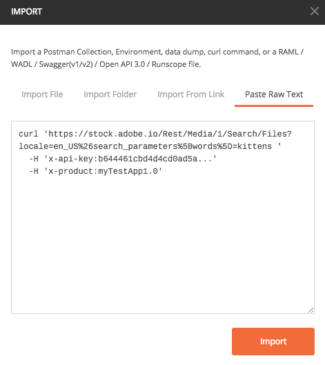
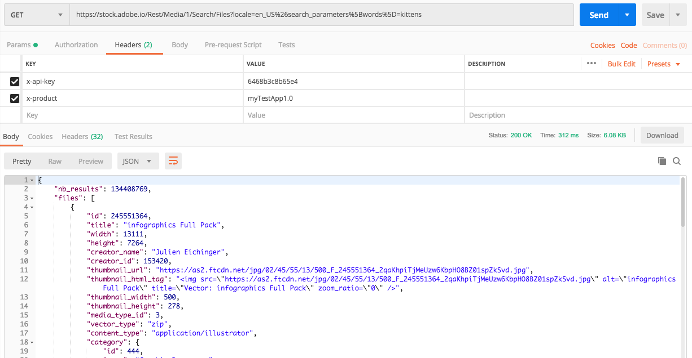

# API Key Connection

A small collection of Adobe services (e.g. Adobe Stock) require authorization, but do not require authentication. These services can be called _“anonymously”_ and typically provide consistent results regardless of the application or user that made the request. An **API Key** is the only client credential required for these services. These connections do not need to pass an access token with each request.

To obtain an API Key, you'll need to create an API Key connection using the Adobe Developer Console.

> **Note:** If your integration needs to access Adobe services or content on behalf of a user or an Adobe enterprise organization, it needs additional credentials for authentication. For more information, check out the articles on **[OAuth Authentication](OAuthIntegration.md)** and **[Service Account (JWT) Authentication](ServiceAccountIntegration.md)**.

This article will walk you through the steps to set up an **API Key** connection.

## API Key connection workflow

[Step 1: Create a project in Adobe Developer Console](#step-1-create-a-project-in-adobe-developer-console)

[Step 2: Add an API to your project using API Key authorization](#step-2-add-an-api-to-your-project-using-API-Key-authorization)

[Step 3: Try It](#step-3-try-it)

### Step 1: Create a project in Adobe Developer Console

Integrations are now created as part of a "project" within Adobe Developer Console. For complete steps to creating a project in Console, begin by reading the [Adobe Developer Console getting started guide]() and [projects overview](). 

Once you have created a project, you will be able to add services including APIs, Adobe I/O Events registrations, and Adobe I/O Runtime.

### Step 2: Add an API to your project using API Key authorization

To add an API that uses API Key authorization, follow the steps outlined in the guide for [adding an API to a project using API Key authorization]().

When the API has been successfully connected, you will be able to access the newly generated API Key.

### Step 3: Try It

Copy the API Key from the Adobe Developer Console project and replace `myAPIKey` in the sample request below.

```curl
curl 'https://stock.adobe.io/Rest/Media/1/Search/Files?locale=en_US%26search_parameters%5Bwords%5D=kittens '
  -H 'x-api-key:myAPIKey'
  -H 'x-product:myTestApp1.0'
```

Open Postman and go to `Import`->`Paste Raw Text` and paste the curl command. Select **Import** to import it.

<kbd></kbd>

Select **Send**. You will receive a successful response. Note that you did not need an access token in order to make a successful request using API Key integration.

<kbd></kbd>
