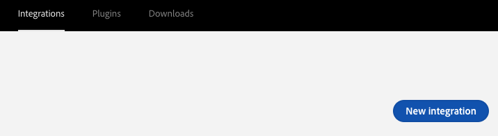
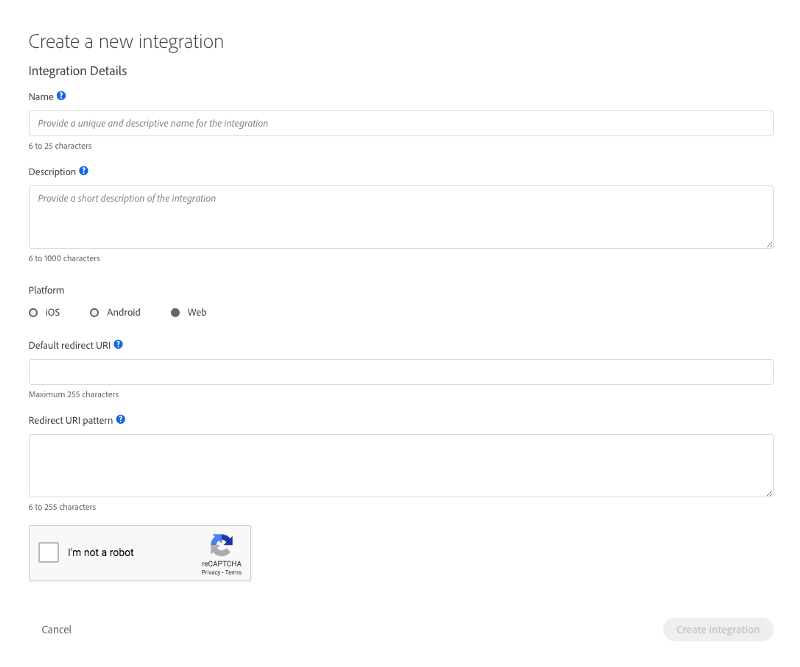
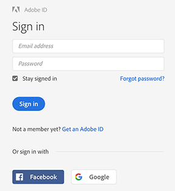
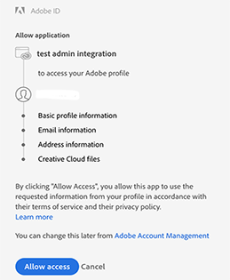

# OAuth Integration

If your application needs to access Adobe services or content, you'll need a set of client credentials to authenticate your app and your user, and authorize access. The type of integration you are building will determine the type of client credentials you will need.

To obtain client credentials for an app that accesses services on behalf of an **end-user**, you'll need to create an **OAuth Integration** using the [Adobe I/O Console](https://console.adobe.io/). You can integrate your app with more than one Adobe service. This article will walk you through the steps to set up an OAuth integration.

OAuth allows your end users to sign in to your integration with an Adobe ID. With an OAuth token, your integration will be able to access Adobe services or content on behalf of the logged in user.

If your integration needs to access Adobe services or content on behalf of an organization (an Adobe enterprise organization), check out the **[Service Account Authentication](/auth/AuthenticationOverview/ServiceAccountIntegration.md)**.

This article will walk you through the steps to set up an **OAuth integration**.

## OAuth Integration Workflow
[Step 1: Subscribe to an Adobe](#step-1-subscribe-to-an-adobe-service)

[Step 2: Configure an API Key Integration](#step-2-configure-an-api-key-integration)

[Step 3: Authorization](#step-3-authorization)

[Step 4: Authentication](#step-4-authentication)

[Step 5: Try It](#step-5-try-it)

### Step 1: Subscribe to an Adobe Service

- To create a new API Key integration, sign in to the [Adobe I/O Console](https://console.adobe.io/) with your Adobe ID, and click New Integration. (Notice that you may also choose existing integrations and edit their details from here.)



- Choose the type of service you want to include in your integration. You can get API access to several Adobe services or subscribe to real-time events. An integration can access multiple services and event sources. Simply perform these steps for each service or event you want to add to your integration.


- Select **Access an API** to create an integration that will access an Adobe product API or service, you will have an opportunity to subscribe to additional services and events once you have created the integration.

- Choose the service or event source that you would like to add to your integration. APIs and products available through Adobe I/O are typically listed by cloud.


- To update an existing integration, simply select it and click **Continue**.

- If you would like to create a brand new integration, select that option and click **Continue**.

### Step 2: Configure an API Key Integration

- The configuration page lets you provide all of the required details for a new integration, or add new information to update an existing integration. On this page:



|Integration Details| |
-----|----
`Name`|Enter a unique name to easily identify your integration
`Description`|Provide a brief description about this integration. If you have multiple applications or access multiple services, you can use these properties to better organize your integrations.
`Platform`|Select a platform on which the integration is intended to be used: `iOS`,`Android`,`Web`
`Default Redirect URI`|After a user successfully authorizes an application, the authorization server will redirect the user back to the application with either an authorization code in the URL. Because the redirect URL will contain sensitive information, it is critical that the service doesn’t redirect the user to arbitrary locations. *(HTTPS required)*
`Redirect URI pattern`|A comma seperated list of URI patterns, to validate additional custom redirect uri passed along with Authorization request. *(HTTPS required)* e.g. `https://www\\.myapp\\.com` will allow redirect uris like `https://www.myapp.com/OAuth/callback`

- Tip: Give your integrations accurate and descriptive names. Integrations are shared with developers within your organization, so choose a name that is clear and easily understood. Generic names like My Test App are discouraged.

- Click **Create integration**.

- When creation is confirmed, visit the overview section for your new integration. The overview section contains the newly generated API Key, and allows you to subscribe to additional services or events.


### Step 3: Authorization
- The first step is to request the authorization token. This request sets the access scope and asks the user to grant permission to your application.

- In order to start this workflow, redirect the user to the Adobe's authorization endpoint:

```https://ims-na1.adobelogin.com/ims/authorize```

- Include the following parameters:

Parameters | Description
---- | ----
`client_id` |	The Client ID obtained from the Adobe I/O Console.
`redirect_uri` |	The URI to which the user agent is redirected once the authorization completes. Note that this URI must be HTTPS. The pattern is validated against the list of valid redirect URIs configured for your client.
`scope`	| The scope of the access request, expressed as a list of comma-delimited, case sensitive strings. See the Scope Reference for more information.
`response_type` |	The default response_type for the Authorization code flow is `code`. Use token for the Implicit grant flow. See below for more information.
`locale` | Optional. The locale code for the authentication UI. Default is en_US.
`state` |	Optional. Client-defined state data that is replayed back to the client. It must not be longer than 255 characters. The value should be sent in JSON format, for example  state={“st”:some_alphanumeric_value}. This parameter should be used to prevent CSRF (Cross-Site Request Forgery).

- *Note that Adobe OAuth does not support the practice of passing Base64 encoded client_id and  client_secret using the HTTP BASIC authorization header.*

- Example URL (code response type):

```
https://ims-na1.adobelogin.com/ims/authorize
?client_id=<client_id>
&redirect_uri=https://www.myapp.com/OAuth/callback
&scope=openid,creative_sdk
&response_type=code
```
**Prompting the user for consent**

- Once the request from the previous step is sent, Adobe will redirect the user to the Adobe ID sign-in page. After sign-in, the user will see a consent window showing the name of your application and the information that your application is requesting permission to access with the user's credentials:

 

- The user can either allow or refuse access.

**Handling the callback**

- Adobe's OAuth 2.0 server will respond to your application's access request by using the redirect URI specified in the request. If the user has signed-in successfully and granted permissions, the OAuth 2.0 server will respond with an authorization code in the query string. If the user has not approved the request, the OAuth 2.0 server will send an error message.

- Example Authorization grant type response (`code` response type):
```
https://www.myapp.com/OAuth/callback?code=eyJ4NXUiOiJpbXNfbmExLWtleS....
```
### Step 4: Authentication
### Step 5: Try It

