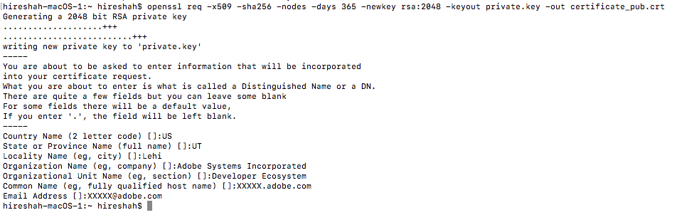
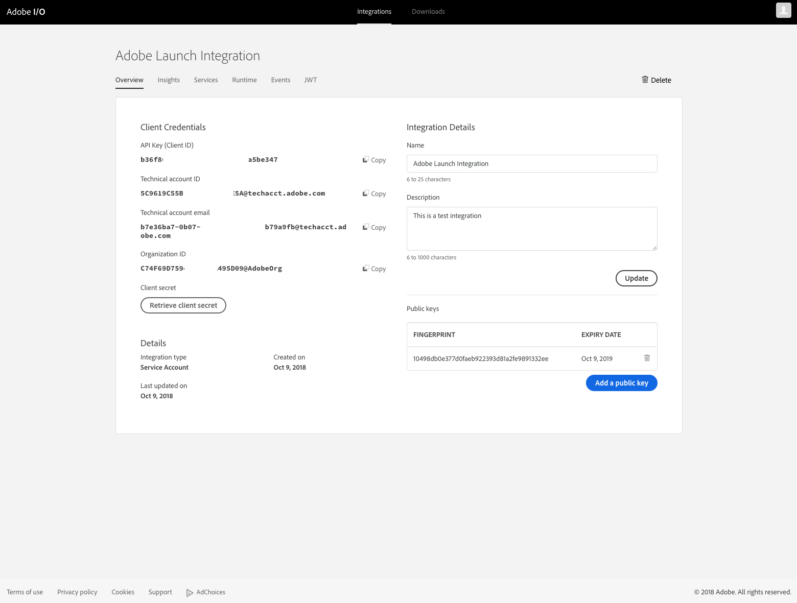
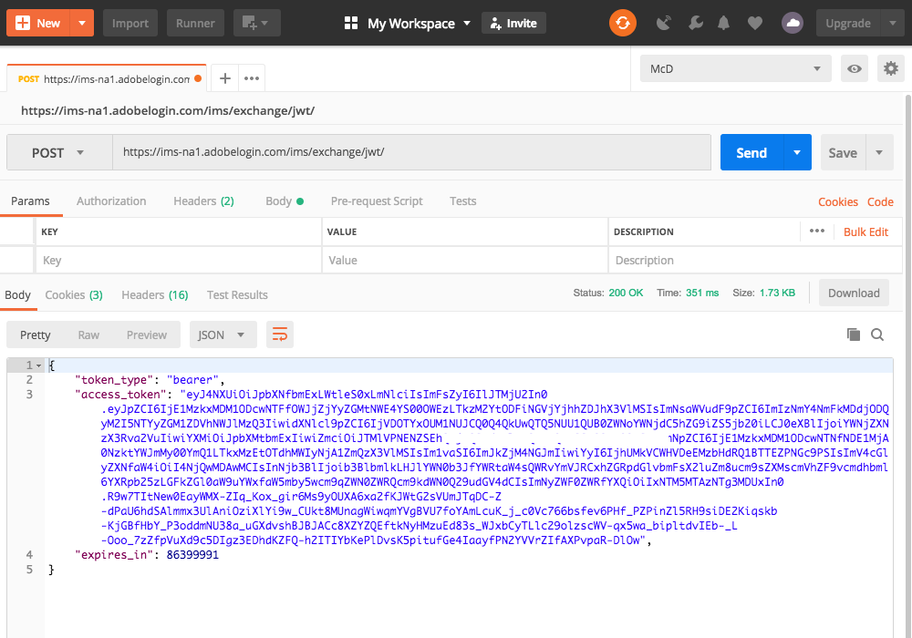

# Service Account Integration

A Service Account integration allows your application to call Adobe services on behalf of the application itself, or on behalf of an enterprise organization.

For this type of integration, you will create a JSON Web Token (JWT) that encapsulates your credentials, and begin each API session by exchanging the JWT for an access token. The JWT encodes all of the identity and security information required to obtain an access token, and must be signed with the private key that is associated with a public key certificate specified on your integration.

This article walks you through the steps to set up a **Service Account integration**.

## Service Account Integration Workflow

[Step 1: Subscribe to an Adobe Service](#step-1-subscribe-to-an-adobe-service)

[Step 2: Create a Public Key Certificate](#step-2-create-a-public-key-certificate)

[Step 3: Configure an API Key Integration](#step-3-configure-an-api-key-integration)

[Step 4: Try It](#step-4-try-it)

### Step 1: Subscribe to an Adobe Service

Regardless of your platform, you begin with the same steps in Adobe I/O Console:

- Create a new integration in Adobe I/O Console: [https://console.adobe.io/integrations](https://console.adobe.io/integrations)

    <kbd></kbd> 

- Choose to access an API.

- Subscribe to an entitled product (for instance, Launch, by Adobe).

    <kbd></kbd>

- Confirm that you want to create a new integration.

### Step 2: Create a Public Key Certificate

- Create a private key and a public certificate. Make sure you store these securely.

- Once you complete the above steps, your path diverges depending on your platform: 

_**MacOS and Linux:**_

- Open a terminal and execute the following command:  

```
openssl req -x509 -sha256 -nodes -days 365 -newkey rsa:2048 -keyout private.key -out certificate_pub.crt
```


<kbd></kbd>

_**Windows:**_

- Download an OpenSSL client to generate public certificates; for example, you can try the [OpenSSL Windows client](https://bintray.com/vszakats/generic/download_file?file_path=openssl-1.1.1-win64-mingw.zip).

- Extract the folder and copy it to the **C:/libs/** location.

- Open a command line window and execute the following commands:

`set OPENSSL_CONF=C:/libs/openssl-1.1.1-win64-mingw/openssl.cnf`

`cd C:/libs/openssl-1.1.1-win64-mingw/`

```
openssl req -x509 -sha256 -nodes -days 365 -newkey rsa:2048 -keyout private.key -out certificate_pub.crt
```

<kbd></kbd>

- Once you&rsquo;ve completed the steps for your chosen platform, continue in the Adobe I/O Console.

### Step 3: Configure an API Key Integration

- Upload the public certificate (certificate_pub.crt) as a part of creating the integration.

    <kbd></kbd>

- Your integration should now be created with the appropriate public certificate and claims.

    <kbd></kbd>
    
### Step 4: Try It

- Go to the JWT tab and paste in you private key to generate a JWT.

    <kbd></kbd>

- Copy the &ldquo;Sample CURL Command&rdquo; to get your first access token. 

    <kbd></kbd>


- Open Postman, then click Import &gt; Paste Raw Text and paste the copied curl command.

    <kbd></kbd>

- Click Send.

    <kbd></kbd>

The example curl sends a POST request to [https://ims-na1.adobelogin.com/ims/exchange/jwt](https://ims-na1.adobelogin.com/ims/exchange/jwt) with the following parameters.

| Parameter | Description|
|---|---|
| `client_id` | The API key generated for your integration. Find this on the I/O Console for your integration. |
| `client_secret` | The client secret generated for your integration. Find this on the I/O Console for your integration. |
| `jwt_token` | A base-64 encoded JSON Web Token that encapsulates the identity of your integration, signed with a private key that corresponds to a public key certificate attached to the integration. Generate this on the I/O Console in the JWT Tab for your integration. Note that this token has the expiration time parameter `exp` set to 24 hours from when the token is generated. | 

You now have your access token. Look up documentation for the specific API service for which you’re hitting authenticated endpoints to find what other parameters are expected. Most of them need an `x-api-key`, which will be the same as your `client_id`.
