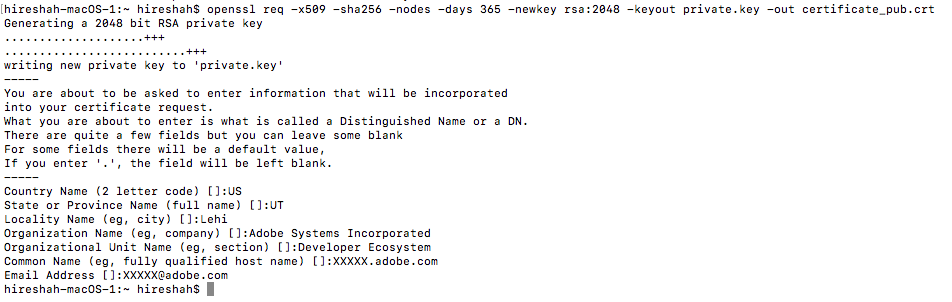
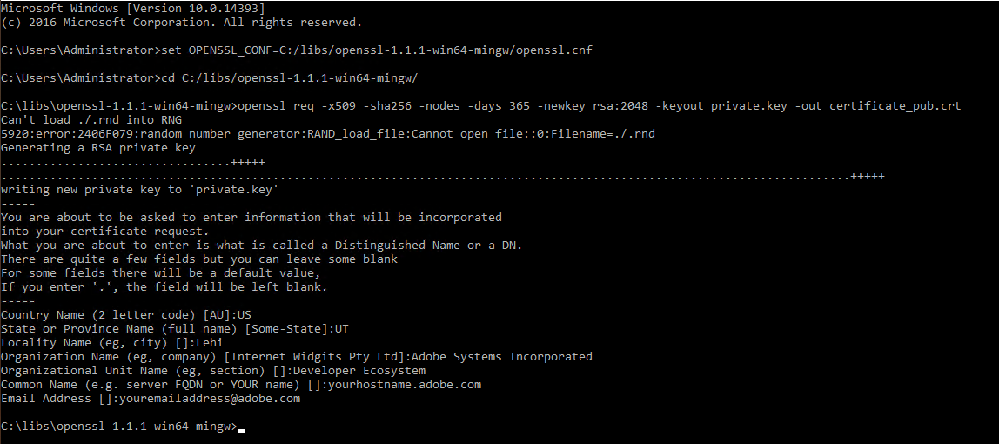
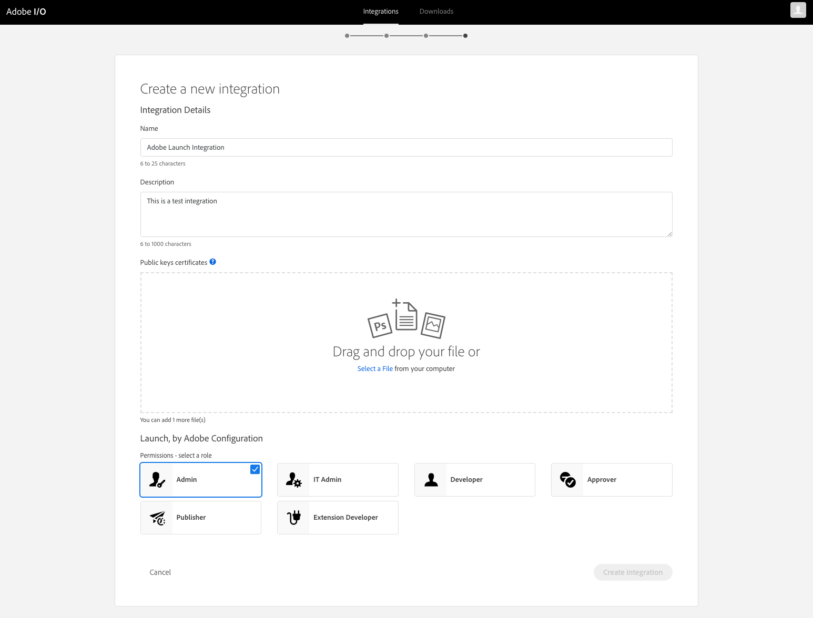
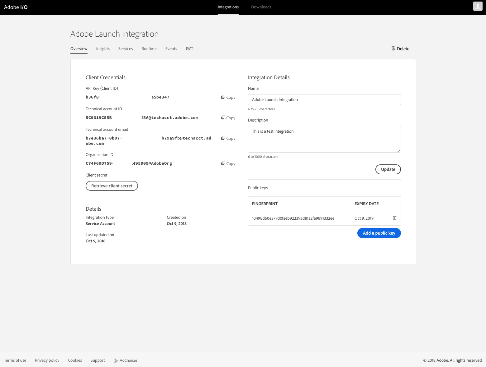

# Create a Public Key Certificate

Create a private key and a public certificate. Make sure you store these securely.

## MacOS and Linux:

Open a terminal and execute the following command:  

`openssl req -x509 -sha256 -nodes -days 365 -newkey rsa:2048 -keyout private.key -out certificate_pub.crt`

<kbd></kbd>

## Windows:

1. Download an OpenSSL client to generate public certificates; for example, you can try the [OpenSSL Windows client](https://bintray.com/vszakats/generic/download_file?file_path=openssl-1.1.1-win64-mingw.zip).

2. Extract the folder and copy it to the **C:/libs/** location.

3. Open a command-line window and execute the following commands:  

    ```
    set OPENSSL_CONF=C:/libs/openssl-1.1.1-win64-mingw/openssl.cnf  
    
    cd C:/libs/openssl-1.1.1-win64-mingw/  
    
    openssl req -x509 -sha256 -nodes -days 365 -newkey rsa:2048 -keyout private.key -out certificate_pub.crt
    ```  
    <kbd></kbd>

4. Once you&rsquo;ve completed the steps for your chosen platform, continue in the Adobe I/O Console.

## Using the Public Key Certificate for Service Account Integration

1. Upload the public certificate (certificate_pub.crt) as a part of creating the integration.

    <kbd></kbd>

2. Your integration should now be created with the appropriate public certificate and claims.

    <kbd></kbd>
