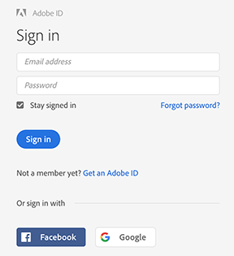
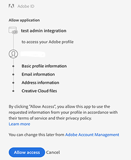

# OAuth 2.0 Authentication

Adobe Cloud Platform APIs use the OAuth 2.0 protocol for authentication and authorization. Using Adobe OAuth 2.0, you can generate an access token which is used to make API calls from your web server or browser-based apps.

The basic Web OAuth 2.0 workflow will look like:

1. Your application **redirects** the user to Adobe along with the list of requested permissions
2. Adobe prompts the user with a login screen and informs the user of the requested permissions
3. The user decides whether to grant the permissions
4. Adobe sends a **callback** to your application to notify whether the user granted the permissions
5. After permissions are granted, your application retrieves tokens required to make API requests on behalf of the user

The process of providing secure access to protected resources has two stages, **authorization** and **authentication**. It is important to understand that they are separate concepts.

- **Authorization** is the process of granting permission to a user to access a protected resource. Because authentication is usually a prerequisite for granting access, these two terms often occur together.
- **Authentication** is the process of determining that a user is who she claims to be. Authentication can be checked by Adobe's own identity provider, the Identity Management Services (IMS).

[Authorization](#authorization)

[Authentication](#authentication)


### Authorization
- The first step is to request the authorization token. This request sets the access scope and asks the user to grant permission to your application.

- In order to start this workflow, redirect the user to the Adobe's authorization endpoint:

```https://ims-na1.adobelogin.com/ims/authorize```

- Include the following parameters:

Parameters | Description
---- | ----
`client_id` |	The Client ID obtained from the [Adobe I/O Console](https://console.adobe.io/).
`redirect_uri` |	The URI to which the user agent is redirected once the authorization completes. Note that this URI must be HTTPS. The pattern is validated against the list of valid redirect URIs configured for your client.
`scope`	| The scope of the access request, expressed as a list of comma-delimited, case sensitive strings. See the Scope Reference for more information.
`response_type` |	The default response_type for the Authorization code flow is `code`. 
`locale` | Optional. The locale code for the authentication UI. Default is en_US.
`state` |	Optional. Client-defined state data that is replayed back to the client. It must not be longer than 255 characters. The value should be sent in JSON format, for example  state={“st”:some_alphanumeric_value}. This parameter should be used to prevent CSRF (Cross-Site Request Forgery).

- *Note that Adobe OAuth does not support the practice of passing Base64 encoded client_id and  client_secret using the HTTP BASIC authorization header.*

- Example URL (code response type):

```
https://ims-na1.adobelogin.com/ims/authorize
?client_id=<client_id>
&redirect_uri=https://www.myapp.com/OAuth/callback
&scope=openid
&response_type=code
```
**Prompting the user for consent**

- Once the request from the previous step is sent, Adobe will redirect the user to the Adobe ID sign-in page. After sign-in, the user will see a consent window showing the name of your application and the information that your application is requesting permission to access with the user's credentials:

<kbd></kbd> <kbd></kbd>

- The user can either allow or refuse access.

**Handling the callback**

- Adobe's OAuth 2.0 server will respond to your application's access request by using the redirect URI specified in the request. If the user has signed-in successfully and granted permissions, the OAuth 2.0 server will respond with an authorization code in the query string. If the user has not approved the request, the OAuth 2.0 server will send an error message.

- Example Authorization grant type response (`code` response type):
```
https://www.myapp.com/OAuth/callback?code=eyJ4NXUiOiJpbXNfbmExLWtleS....
```
### Authentication

- After receiving the authorization code, send a POST request to the token endpoint:
```
https://ims-na1.adobelogin.com/ims/token/
```
- Include the following parameters:

Parameters | Description
---- | ----
code |	The base-64 encoded `authorization_code` returned from the  /ims/authorize/ request in callback.
grant_type |	The constant value `authorization_code`.
client_id |	The Client ID obtained from the [Adobe I/O Console](https://console.adobe.io/).
client_secret |	The Client Secret obtained from the [Adobe I/O Console](https://console.adobe.io/).

*Note that Adobe OAuth does not support the practice of passing Base64 encoded client_id and  client_secret using the HTTP BASIC authorization header.*

- Example Request:

```curl
curl -X POST \
  https://ims-na1.adobelogin.com/ims/token \
  -H 'Content-Type: application/x-www-form-urlencoded' \
  -H 'cache-control: no-cache' \
  -d 'code=eyJ4NXUiOiJpbXNfbmExLWt.......&grant_type=authorization_code&client_id=0b623b30......&client_secret=a9a10933-95d9-......'
  ```
  
- Example response:
```
HTTP/1.1 200 OK
Content-Type: application/json;charset=UTF-8

{
    "access_token": "eyJ4NXU...",
    "refresh_token": "eyJ4NXU...",
    "sub": "5BEB2BB...@AdobeID",
    "address": {
        "country": "US"
    },
    "email_verified": "true",
    "name": "USERNAME",
    "token_type": "bearer",
    "given_name": "USERNAME",
    "expires_in": 86399985,
    "family_name": "USERNAME",
    "email": "USERNAME@example.com"
}
```
- Similar to above, note that in addition to the access_token and refresh_token, the response also includes a JSON array of profile data that your client_id is authorized for and appropriate for the  scope that you requested.
