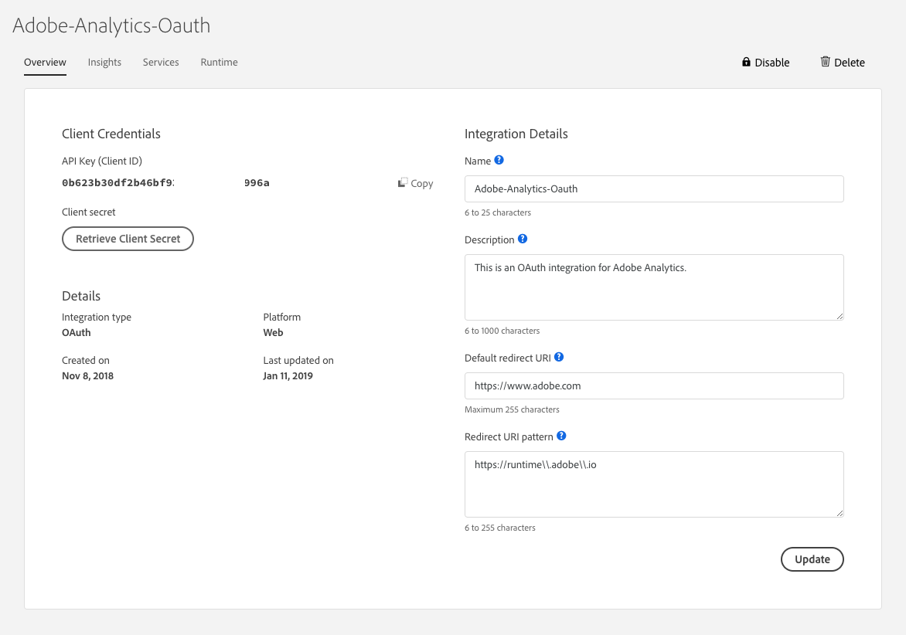

# OAuth 2.0 Playground

## Steps
1. Go to [OAuth 2.0 Playground](https://adobeioruntime.net/api/v1/web/io-solutions/adobe-oauth-playground/oauth.html)

<kbd></kbd>

2. Go to the [Adobe I/O Console](https://console.adobe.io)

3. Create an integration-> Select Access an API-> Select services you wish to integrate with (e.g. Adobe Analytics->OAuth 2.0 Integration)

4. Provide the Redirect URI pattern as **https://runtime\\.adobe\\.io**

<kbd></kbd>

5. Copy **API Key**, **Client Secret** from Adobe I/O Console integration to OAuth 2.0 Playground

6. Enter scopes as:
```
openid,read_organizations,additional_info.projectedProductContext,additional_info.job_function
```

<kbd></kbd>

7. Click on `Generate Tokens`

8. You will be prompted for login by Adobe. Login using your Adobe ID. Click `Sign In`

<kbd></kbd>

9. Your tokens will be generated.

<kbd></kbd>
