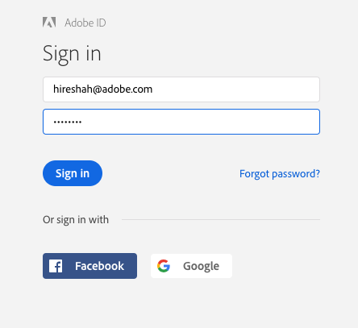

# OAuth 2.0 Playground

The OAuth 2.0 Playground is an Adobe internet utility that enables developers to easily obtain an OAuth 2.0 access token for use in building and testing their integrations. Before you use the OAuth 2.0 Playground, you should already have created an integration you want to use for this purpose. The OAuth 2.0 Playground source code is also available for you to view and experiment with.

## Steps to obtain a token:

1. Go to [OAuth 2.0 Playground](https://adobeioruntime.net/api/v1/web/io-solutions/adobe-oauth-playground/oauth.html)  
  
    <kbd></kbd>

2. Go to the [Adobe Developer Console](https://www.adobe.com/go/devs_console_ui)

3. Create a project within Console. For complete steps to creating a project in Console, begin by reading the [Adobe Developer Console getting started guide]() and [projects overview](). 

4. Once you have created a project, you will be able to add services including APIs, Adobe I/O Events registrations, and Adobe I/O Runtime. Add an API to your project and then select the services with which you wish to integrate (such as Adobe Analytics > OAuth 2.0 Integration)

    To add an API that uses OAuth authentication and authorization, follow the steps outlined in the guide for [adding an API to a project using OAuth authentication]().

    When the API has been successfully connected, you will be able to access the newly generated credentials including Client ID and Client Secret.

5. Copy your **Client ID** (API Key) and **Client Secret** from Adobe Developer Console into the OAuth 2.0 Playground.

6. Enter scopes as:  
  `openid,read_organizations,additional_info.projectedProductContext,additional_info.job_function`  
    
      <kbd></kbd>

7. Click **Generate Tokens.**

8. You will be prompted for login by Adobe. Log in using your Adobe ID.  
  
    <kbd></kbd>

9. Your tokens will be generated.  
  
    <kbd></kbd>
